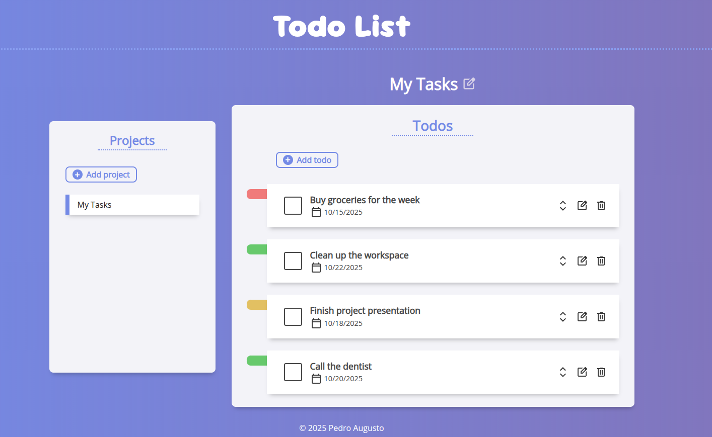
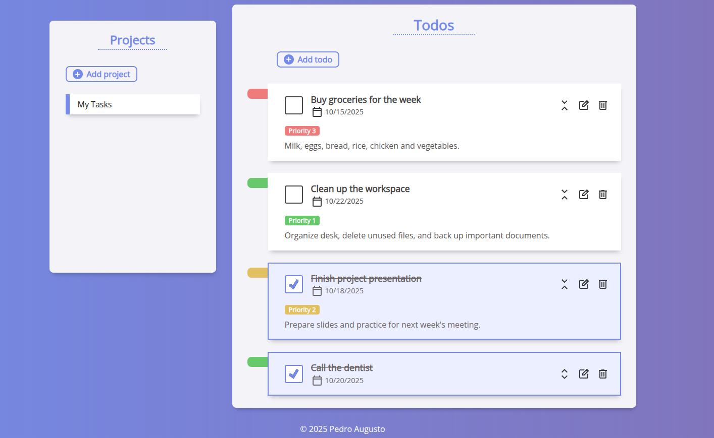
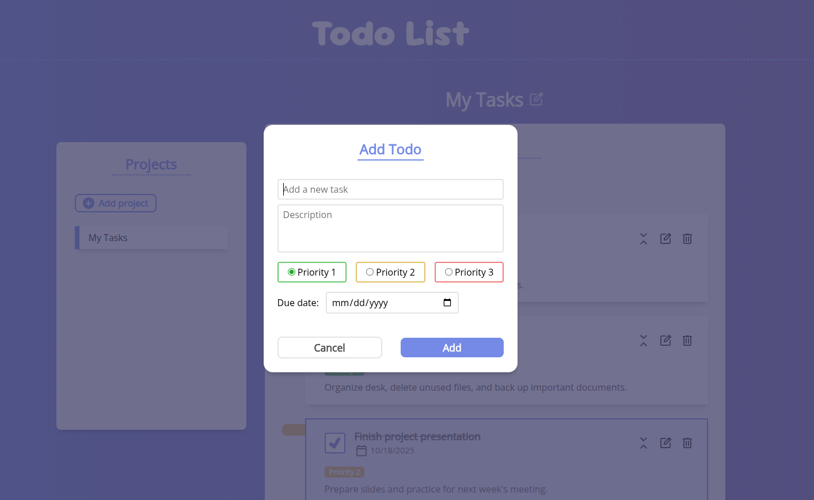
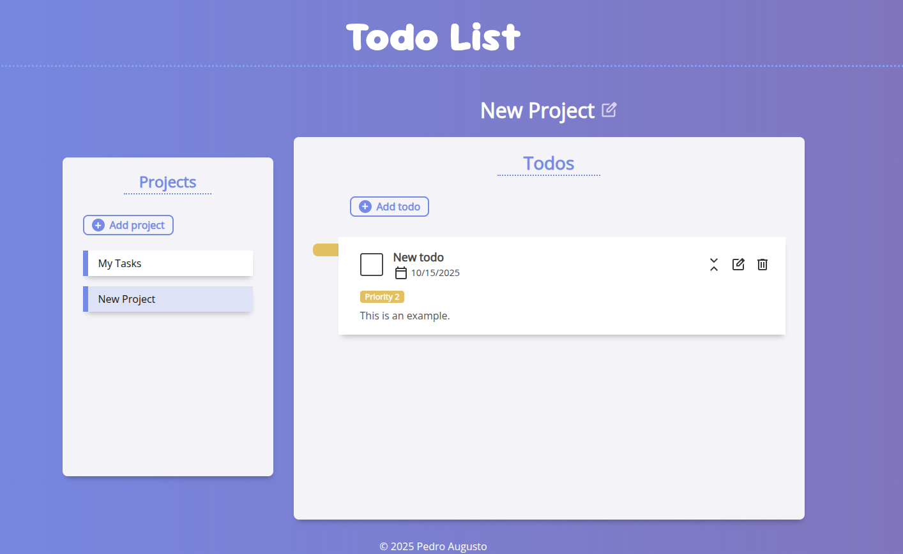

# Todo List

## Description

- A simple to-do list application that lets users create and manage tasks and projects. Users can add tasks, mark them as complete, set priority levels, add descriptions and define due dates. Tasks can also be grouped into projects, allowing better organization of related items. All data is persisted locally using the browser's `localStorage`.
- **Main features:**
    - Webpack module bundler
    - DOM manager module (create/edit/delete DOM elements)
    - Storage manager module (store/update/delete data using `localStorage`)
    - SOLID principles

## Live Demo

**[Click here](https://pedroasb.github.io/todo-list/)** to try out this project on browser.

## Screenshots

## About the Project

This project is part of the curriculum of [The Odin Project](https://www.theodinproject.com/). You can check out other projects that I've built in my [fullstack-journey](https://github.com/PedroASB/fullstack-journey) repository.

## Attributions

- **Icons**
    - Icons by [Google](https://fonts.google.com/icons) – Licensed under Apache 2.0
- **Fonts**
    - Open Sans, Sour Gummy — all available on [Google Fonts](https://fonts.google.com/) under the Open Font License
